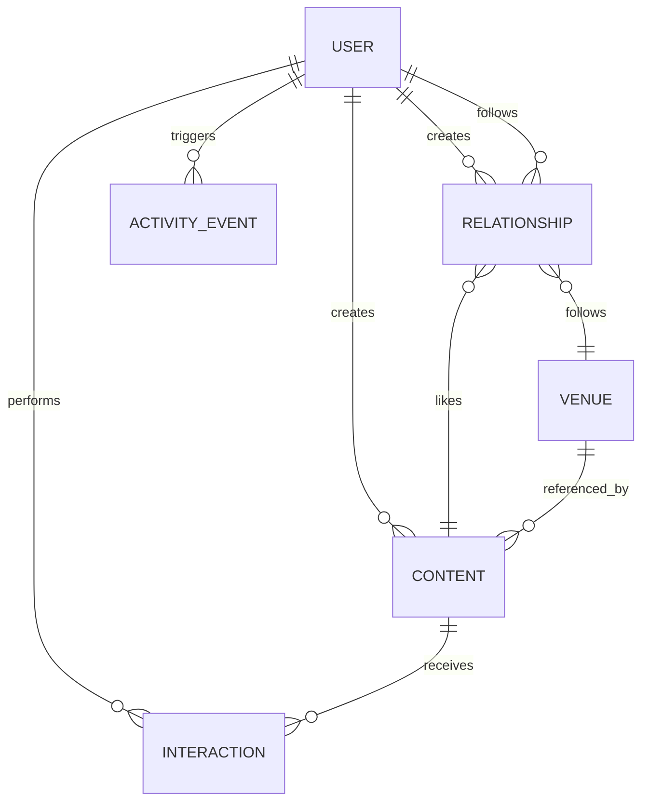

# Data Model And Analytics Overview

This document explains the current conceptual model, physical database schemas, Python application flow, visualisation framework, and useful analytical queries for the Social Network Analytics Platform.

## System Purpose

The project models a social network where users publish and consume content, interact with restaurants or cultural venues, and create social relationships such as follows and likes.

The platform uses two databases because the workload has two shapes:

- MongoDB stores the full operational documents and supports aggregation analytics.
- Neo4j stores a graph projection for relationship traversal, influence analysis, and graph-based recommendations.
- Kafka carries real-time activity events so activity can be observed as a stream.

Python coordinates ingestion, validation, API operations, MongoDB writes, Kafka activity-event publishing, Neo4j projection, and visualisation queries.

## Conceptual Model

The main conceptual entities are:

| Entity | Meaning | Main relationships |
| --- | --- | --- |
| User | A social platform account | Creates content, views content, likes content, follows users, follows venues |
| Content | A post, review, or comment | Created by a user, can reference a venue, can be liked or viewed |
| Venue | A restaurant or cultural place | Can be followed, referenced by content, displayed on maps |
| Interaction | A view event | Connects a user, optionally anonymous, to content consumption |
| Relationship | A social edge | Represents `like` or `follow` actions |
| ActivityEvent | Audit or activity timeline event | Records important user actions |
| Sentiment | Embedded metadata on content | Supports positive, neutral, and negative analytics |
| Metrics | Embedded counters on content | Stores view, like, comment, and share counters |

Conceptual relationship sketch:



In MongoDB, relationships are documents. In Neo4j, selected relationships become graph edges.

## Physical Database Structure

### MongoDB

MongoDB is the source of truth for full documents. The active collections are:

| Collection | Purpose | Important fields |
| --- | --- | --- |
| `users` | User profiles and recent embedded interactions | `_id`, `username`, `display_name`, `city`, `interests`, `recent_interactions`, `created_at` |
| `content` | Posts, reviews, and comments in one polymorphic collection | `_id`, `type`, `author_id`, `text`, `venue_id`, `parent_content_id`, `style`, `category`, `hashtags`, `sentiment`, `metrics`, `created_at` |
| `interactions` | View events | `_id`, `type`, `user_id`, `content_id`, `source`, `session_id`, `duration_ms`, `created_at` |
| `relationships` | Likes and follows | `_id`, `type`, `source_user_id`, `target_type`, `target_id`, `projection_status`, `projected_at`, `created_at` |
| `venues` | Restaurant or cultural venue documents | `_id`, `name`, `domain`, `category`, `city`, `locality`, `cuisines`, `pricing`, `features`, `rating`, `location`, `created_at` |
| `activity_events` | Audit/activity timeline events | `_id`, `type`, `actor_user_id`, `target_type`, `target_id`, `metadata`, `created_at` |

MongoDB JSON Schema validators live under `schema/` and are applied by `src/mongo_schema.py`.

MongoDB indexes are also declared in `src/mongo_schema.py`. They cover the dashboard filters, date ranges, joins through `content_id` and `venue_id`, relationship lookups, city/category filters, venue maps, and rating or pricing charts.

The optional `activity_event_consumption_log` collection is used by the Kafka demo consumer. It is not a source-of-truth collection; it proves that events from the `activity-events` topic were consumed.

### Neo4j

Neo4j stores a graph projection, not the full source documents.

Node labels:

| Label | Meaning | Key properties |
| --- | --- | --- |
| `User` | Social user | `id`, `username`, `display_name`, `city` |
| `Content` | Any content item | `id`, `type`, `author_id`, `created_at`, `style`, `category`, `venue_id`, `sentiment_label`, `hashtags` |
| `Post`, `Review`, `Comment` | Additional labels on `Content` nodes | Same node as `Content`, with type-specific label |
| `Venue` | Venue node | `id`, `name`, `city`, `category`, `cuisines`, `aggregate_rating`, `votes`, `longitude`, `latitude` |

Relationship types:

| Relationship | Direction | Meaning |
| --- | --- | --- |
| `FOLLOWS` | `(User)-[:FOLLOWS]->(User)` | User follows another user |
| `FOLLOWS` | `(User)-[:FOLLOWS]->(Venue)` | User follows a venue |
| `CREATED` | `(User)-[:CREATED]->(Content)` | Content authorship projected from `content.author_id` |
| `LIKED` | `(User)-[:LIKED]->(Content)` | User likes content |
| `VIEWED` | `(User)-[:VIEWED]->(Content)` | Aggregated known-user view events |
| `SIMILAR_TO` | `(Content)-[:SIMILAR_TO]->(Content)` | Content similarity generated by projection logic |

Neo4j indexes are declared in `src/neo4j_schema.py` and applied by `/bootstrap` or `python -m src.init_neo4j`.

`VIEWED` is a summary projection. MongoDB `interactions` remains the raw event history; Neo4j stores one aggregate edge per known user/content pair with count, first/last view time, total duration, and last source.

### Kafka

Kafka is the initial real-time activity stream for the project.

Topic:

| Topic | Purpose |
| --- | --- |
| `activity-events` | Content, relationship, and known-user view events emitted after MongoDB activity-event persistence |

Initial Kafka event envelope:

| Field | Meaning |
| --- | --- |
| `event_id` | MongoDB activity event id |
| `event_type` | Event name such as `content_created`, `like_created`, or `view_created` |
| `occurred_at` | Activity event creation timestamp |
| `actor_user_id` | User who performed the action |
| `target_type` | Target category: `content`, `user`, or `venue` |
| `target_id` | Target document or graph node id |
| `source_service` | Service that emitted the event |
| `payload` | Event-specific metadata copied from the activity event metadata |

Kafka is deliberately not the source of truth in this phase. The service first writes MongoDB, then publishes to Kafka on a best-effort basis. If Kafka is unavailable, the MongoDB write still succeeds and the publish error is logged.

## Example Schemas

### User Document

```json
{
  "_id": "user_123",
  "username": "alice",
  "display_name": "Alice",
  "city": "Rome",
  "interests": ["food", "travel"],
  "recent_interactions": [
    {
      "type": "view",
      "content_id": "content_456",
      "source": "feed",
      "duration_ms": 8200,
      "created_at": "2026-06-15T10:20:00Z"
    }
  ],
  "created_at": "2026-01-01T09:00:00Z"
}
```

### Content Document

```json
{
  "_id": "content_456",
  "type": "post",
  "author_id": "user_123",
  "text": "Great dinner near the city center.",
  "style": "food",
  "category": "restaurant",
  "venue_id": "restaurant_789",
  "hashtags": ["dinner", "rome"],
  "sentiment": {
    "label": "positive",
    "score": 0.91,
    "polarity": 4
  },
  "metrics": {
    "view_count": 120,
    "like_count": 18,
    "comment_count": 4,
    "share_count": 2,
    "last_viewed_at": "2026-06-20T18:00:00Z"
  },
  "created_at": "2026-06-10T12:00:00Z"
}
```

### Interaction Document

```json
{
  "_id": "interaction_001",
  "type": "view",
  "user_id": "user_123",
  "content_id": "content_456",
  "source": "recommendation",
  "session_id": "session_abc",
  "duration_ms": 12500,
  "created_at": "2026-06-20T18:00:00Z"
}
```

### Relationship Document

```json
{
  "_id": "relationship_001",
  "type": "like",
  "source_user_id": "user_123",
  "target_type": "content",
  "target_id": "content_456",
  "projection_status": "synced",
  "projected_at": "2026-06-20T18:01:00Z",
  "created_at": "2026-06-20T18:00:30Z"
}
```

### Venue Document

```json
{
  "_id": "restaurant_789",
  "source": "kaggle_restaurant_dataset",
  "name": "Example Trattoria",
  "domain": "gastronomy",
  "category": "Italian",
  "city": "Rome",
  "locality": "Centro",
  "cuisines": ["Italian", "Pizza"],
  "pricing": {
    "average_cost_for_two": 45,
    "currency": "EUR",
    "price_range": 3
  },
  "features": {
    "has_table_booking": true,
    "has_online_delivery": false,
    "is_delivering_now": false
  },
  "rating": {
    "aggregate_rating": 4.4,
    "rating_text": "Very Good",
    "votes": 320
  },
  "location": {
    "type": "Point",
    "coordinates": [12.4964, 41.9028]
  },
  "created_at": "2026-06-01T10:00:00Z"
}
```

## Python Application Structure

The Python application is split into clear layers.

| Layer | Files | Responsibility |
| --- | --- | --- |
| Settings and connections | `src/settings.py`, `src/db.py` | Load environment variables and create MongoDB/Neo4j clients |
| Domain models | `src/domain/models.py`, `src/domain/enums.py` | Pydantic validation, document conversion, enum constraints |
| Repositories | `src/repositories/*.py` | Low-level MongoDB CRUD and Neo4j projection queries |
| Services | `src/services/*.py` | Business operations such as creating content, interactions, relationships, and activity events |
| Event streaming | `src/event_streaming.py`, `src/kafka_activity_consumer.py` | Kafka activity-event envelope publishing and demo consumption |
| API | `src/main.py` | FastAPI endpoints for health, bootstrap, users, content, relationships, interactions |
| Bootstrap/schema | `src/mongo_schema.py`, `src/neo4j_schema.py`, `src/init_mongodb.py`, `src/init_neo4j.py` | Create collections, validators, and indexes |
| Data processing | `src/data_processing/*.py` | Import synthetic data, restaurant venues, Sentiment140 posts, relationships, and similarity projections |

### Operation Flow Examples

Creating a user:

1. `POST /users` receives a `UserCreate` payload.
2. `UserService.upsert_user()` validates and converts it to `UserDocument`.
3. `UserRepository.upsert()` writes to MongoDB.
4. `Neo4jUserRepository.project_user()` creates or updates the `User` node.

Creating content:

1. `POST /content` receives a discriminated `post`, `review`, or `comment`.
2. `ContentService.create_content()` converts it to the correct content document.
3. MongoDB stores the full content document.
4. Neo4j receives a `Content` node plus an extra `Post`, `Review`, or `Comment` label.
5. Neo4j receives a `(User)-[:CREATED]->(Content)` authorship edge.
6. An `activity_events` document records the creation.
7. The persisted activity event is published to Kafka topic `activity-events`.

Creating an interaction:

1. `POST /interactions` stores a `view` document in MongoDB.
2. `ContentRepository.increment_interaction_counter()` increments `content.metrics.view_count`.
3. If `user_id` exists, `UserRepository.push_recent_interaction()` embeds the event in `users.recent_interactions`.
4. If `user_id` exists, `Neo4jRepository.project_viewed_interaction()` updates the aggregate `VIEWED` edge.
5. If `user_id` exists, a `view_created` activity event is written and published to Kafka.

Creating a relationship:

1. `POST /relationships` stores a `like` or `follow` document.
2. `Neo4jRepository.project_relationship()` creates the graph edge.
3. The relationship document is marked `synced` or `failed`.
4. An activity event is written and published to Kafka.

## Visualisation Framework

The dashboard is built with Streamlit and Plotly.

| File | Responsibility |
| --- | --- |
| `visualisation/streamlit_app.py` | Page layout, sidebar filters, tabs, cached fetches, tables, empty states |
| `visualisation/data_access.py` | Cached MongoDB and Neo4j connections from environment variables |
| `visualisation/mongo_queries.py` | MongoDB aggregation pipelines for KPIs, charts, feed selection, recommendations, and filter relevance scores |
| `visualisation/neo4j_queries.py` | Cypher queries for graph summaries |
| `visualisation/charts.py` | Plotly chart builders |

Dashboard tabs:

| Tab | Main questions |
| --- | --- |
| Overview | How large and active is the platform? |
| Content | What is being posted and how does sentiment change over time? |
| Engagement | Where do views come from and who is most active? |
| User Feed | Which users and venues should drive recommendation analysis? |
| Venues / Location | Which cities, cuisines, prices, ratings, and maps matter? |
| Relations | Which users, venues, and content are important in the graph? |

The dashboard uses `st.cache_resource` for database clients and `st.cache_data` for expensive read queries. The current cache TTL is 5 minutes for query results and 30 seconds for connection checks. The sidebar includes a `Refresh data` button to clear cached results after imports or database updates.

## Filter Relevance Scores

The dashboard filter dropdowns show a count in brackets so users can avoid low-signal filter values.

Examples:

```text
Rome [12,430]
food [8,201]
positive [14,992]
feed [22,103]
```

The selected value remains the raw value, such as `Rome` or `food`.

Current relevance calculation:

| Filter | Score |
| --- | --- |
| City | users in city + venues in city + venue-linked content in city + views on venue-linked content |
| Content type/style/category/sentiment | matching content count + views on matching content |
| Interaction source | number of interactions with that source |
| User Feed user | views + engaged content count |
| User Feed venue | views + engaged content count + viewer count |

## Useful MongoDB Queries

### Platform Overview

Useful for KPI cards:

```javascript
db.content.aggregate([
  { "$match": { "created_at": { "$gte": start, "$lte": end } } },
  { "$group": { "_id": "$type", "count": { "$sum": 1 } } },
  { "$sort": { "count": -1 } }
])
```

### Content Over Time

Useful for content trend charts:

```javascript
db.content.aggregate([
  { "$match": { "created_at": { "$gte": start, "$lte": end } } },
  {
    "$group": {
      "_id": {
        "date": { "$dateTrunc": { "date": "$created_at", "unit": "day" } },
        "type": "$type"
      },
      "count": { "$sum": 1 }
    }
  },
  { "$sort": { "_id.date": 1, "_id.type": 1 } }
])
```

### Engagement By Source

Useful for finding the strongest traffic channel:

```javascript
db.interactions.aggregate([
  { "$match": { "created_at": { "$gte": start, "$lte": end } } },
  {
    "$group": {
      "_id": "$source",
      "views": { "$sum": 1 },
      "avg_duration_ms": { "$avg": "$duration_ms" }
    }
  },
  { "$sort": { "views": -1 } }
])
```

### City-Based Venue Engagement

Useful for location analytics:

```javascript
db.interactions.aggregate([
  { "$lookup": { "from": "content", "localField": "content_id", "foreignField": "_id", "as": "content_doc" } },
  { "$unwind": "$content_doc" },
  { "$lookup": { "from": "venues", "localField": "content_doc.venue_id", "foreignField": "_id", "as": "venue" } },
  { "$unwind": "$venue" },
  { "$group": { "_id": "$venue.city", "views": { "$sum": 1 } } },
  { "$sort": { "views": -1 } }
])
```

### Recommendation Candidates

The dashboard supports three recommendation styles:

- Posts similar to previously liked content.
- Posts similar to previously engaged content.
- Posts liked by similar users.

These queries are implemented in `visualisation/mongo_queries.py` using content profiles built from types, styles, categories, sentiments, venues, and hashtags.

## Useful Neo4j Queries

### Most Followed Users

```cypher
MATCH (:User)-[rel:FOLLOWS]->(target:User)
RETURN target.id AS user_id, count(rel) AS followers
ORDER BY followers DESC
LIMIT 20;
```

### Most Followed Venues

```cypher
MATCH (:User)-[rel:FOLLOWS]->(venue:Venue)
RETURN venue.id AS venue_id,
       coalesce(venue.name, venue.id) AS name,
       venue.city AS city,
       count(rel) AS followers
ORDER BY followers DESC
LIMIT 20;
```

### Most Liked Content

```cypher
MATCH (:User)-[rel:LIKED]->(content:Content)
RETURN content.id AS content_id,
       content.type AS type,
       content.style AS style,
       content.sentiment_label AS sentiment,
       count(rel) AS likes
ORDER BY likes DESC
LIMIT 20;
```

### Top Creators

```cypher
MATCH (u:User)-[:CREATED]->(content:Content)
RETURN u.id AS user_id,
       count(content) AS created_content
ORDER BY created_content DESC
LIMIT 20;
```

### Most Viewed Content In The Graph Projection

```cypher
MATCH (:User)-[viewed:VIEWED]->(content:Content)
RETURN content.id AS content_id,
       sum(viewed.count) AS views,
       count(DISTINCT viewed) AS unique_viewer_edges
ORDER BY views DESC
LIMIT 20;
```

### Strongest Similar Content

```cypher
MATCH (source:Content)-[rel:SIMILAR_TO]->(target:Content)
RETURN source.id AS source_content_id,
       target.id AS target_content_id,
       rel.score AS score,
       rel.reason AS reason,
       rel.shared_hashtags AS shared_hashtags
ORDER BY score DESC
LIMIT 50;
```

### Recommendations From Viewed Content

```cypher
MATCH (u:User {id: $user_id})-[viewed:VIEWED]->(seen:Content)-[sim:SIMILAR_TO]->(candidate:Content)
WHERE NOT (u)-[:LIKED]->(candidate)
  AND NOT (u)-[:VIEWED]->(candidate)
RETURN candidate.id AS content_id,
       sum(viewed.count * sim.score) AS score
ORDER BY score DESC
LIMIT 20;
```

## Useful Analytical Questions

The current model can answer:

- Which cities have the most users, venues, content, and engagement?
- Which content types, styles, or categories are most active?
- Which traffic source generates the most views and longest average duration?
- Which posts or reviews have unusually high engagement?
- How does sentiment change over time?
- Which venues have high ratings but low visibility?
- Which cuisines are common in each city?
- Which users are most active or most followed?
- Which users create the most content?
- Which venues are most followed?
- Which content is most liked?
- Which content has the most known-user graph views?
- Which content items are similar by style, category, venue, hashtags, and sentiment?
- Which recommendation candidates match a selected user's prior behavior, followed authors, or graph-viewed content?

## Data Flow

```text
Raw data files
  -> Python import scripts
  -> Pydantic domain validation
  -> MongoDB collections
  -> Kafka activity-events stream
  -> Service-layer projection
  -> Neo4j graph nodes and edges
  -> Streamlit dashboard
  -> MongoDB aggregations and Neo4j Cypher summaries
```

## Runtime And Initialization

Start the stack:

```powershell
docker compose up --build
```

Docker Compose runs the MongoDB and Neo4j bootstrap automatically. To re-apply validators and indexes manually:

```powershell
Invoke-RestMethod -Method Post http://localhost:8000/bootstrap
```

Or run the initializers directly:

```powershell
docker compose exec app python -m src.init_mongodb
docker compose exec app python -m src.init_neo4j
```

Open the dashboard:

```text
http://localhost:8501
```

Open Kafka UI:

```text
http://localhost:8080
```

Run the demo Kafka consumer:

```powershell
docker compose exec app python -m src.kafka_activity_consumer
```

## Design Notes

- MongoDB keeps the richest document data and is best for aggregation-heavy dashboard queries.
- Kafka carries activity events for real-time observation, but it does not replace MongoDB.
- Neo4j keeps graph relationships and is best for multi-hop or centrality-style analysis.
- The Python service layer keeps MongoDB and Neo4j synchronized when API operations create users, content, or relationships.
- MongoDB interactions are the source-of-truth event log; Neo4j `VIEWED` edges are rebuildable aggregates.
- Neo4j projection remains service-layer direct in the first Kafka phase to avoid mixing the streaming demo with projection migration.
- The dashboard reads from live databases, not directly from raw CSV or JSON files.
- The restaurant dataset is a venue snapshot, so venue `created_at` is an import timestamp rather than a business event time.
- The synthetic datasets are useful for demonstration and query practice, but they should not be interpreted as real user behavior.
